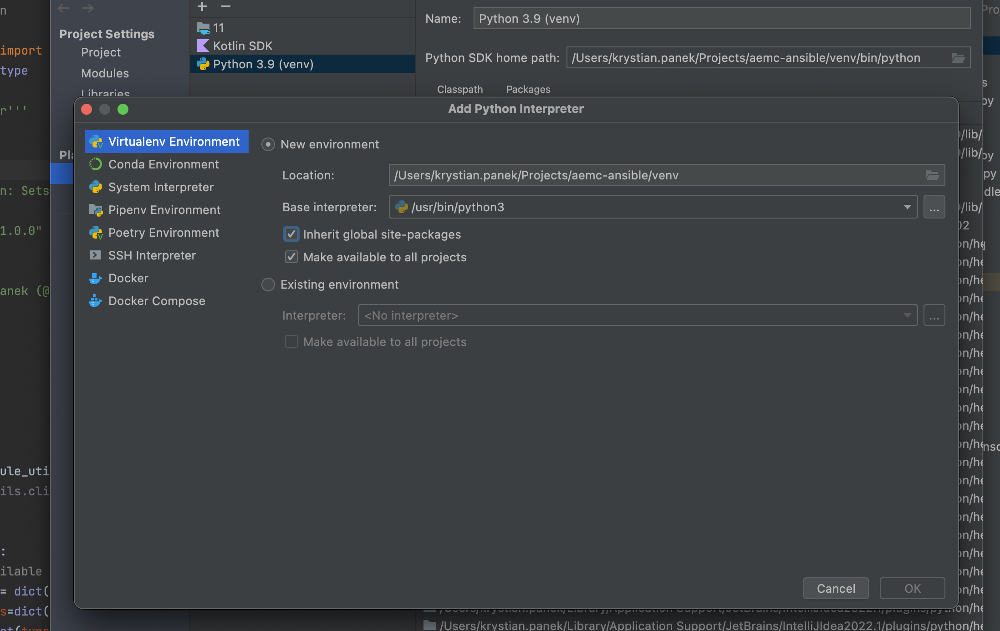
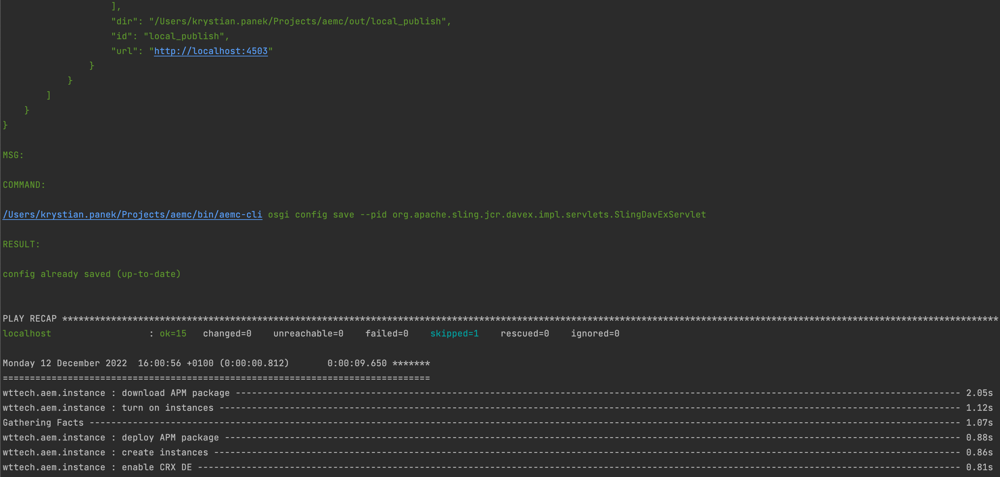

**AEM Compose** - Ansible Collection.

Provides modules and roles built on top of [AEM Compose CLI](https://github.com/wttech/aemc) to provision [AEM](https://business.adobe.com/products/experience-manager/adobe-experience-manager.html) instances to desired state.
Configuration changes are applied idempotently in the Ansible spirit to reduce execution time making the tool effective in practice.

## Example configuration

1. Vars 

   All configuration options available for AEM Compose CLI are also supported in Ansible.
   It is only needed to nest config values under `aem` Ansible variable defined anywhere e.g in the playbook or custom role (according to own [preferences](https://docs.ansible.com/ansible/latest/playbook_guide/playbooks_variables.html#where-to-set-variables)).
   This special variable is passed to all AEM Compose modules automatically for the sake of simplicity.

   ```yaml
   aem: 
     instance:
    
     config:
       local_author:
         http_url: http://127.0.0.1:4502
         user: admin
         password: admin
         run_modes: [ local ]
         # ...
       local_publish:
         # ...

     package:
       snapshot_patterns: [ "**/*-SNAPSHOT.zip" ]
       snapshot_deploy_skipping: true
   
   # ...
   ```

   Consider reviewing [default vars](roles/instance/defaults/main/aem.yml) defined for [instance role](roles/instance).
   

2. Playbook:

    ```yaml 
    - name: create instances
      wttech.aem.instance:
        command: create
    
    - name: turn on instances
      wttech.aem.instance:
        command: up
    
    - name: configure replication agent
      wttech.aem.repl_agent:
        command: setup
        instance_id: local_author
        location: author
        name: publish
        props:
          enabled: true
          transportUri: "{{ aem.instance.config.local_publish.http_url }}/bin/receive?sling:authRequestLogin=1"
          transportUser: "{{ aem.instance.config.local_publish.user }}"
          transportPassword: "{{ aem.instance.config.local_publish.password }}"
          userId: "{{ aem.instance.config.local_publish.user }}"
    
    - name: deploy APM package
      wttech.aem.pkg:
        command: deploy
        url: https://github.com/wttech/APM/releases/download/apm-5.5.1/apm-all-5.5.1.zip
    
    - name: read some node
      wttech.aem.repo_node:
        command: read
        instance_id: local_author
        path: /content/cq:tags/experience-fragments
      register: res
    
    - name: print node creation time
      debug:
        msg: "Node '/content/cq:tags/experience-fragments' was created at '{{ res.data.node.properties['jcr:created'] }}'"
    
    - name: save some node
      wttech.aem.repo_node:
        command: save
        instance_id: local_author
        path: /content/foo
        props:
          foo: bar3
    
    - name: read some bundle
      wttech.aem.osgi_bundle:
        command: read
        instance_id: local_author
        symbolic_name: com.day.cq.wcm.cq-wcm-core
      register: res
    
    - name: print read bundle ID
      debug:
        msg: "Bundle 'com.day.cq.wcm.cq-wcm-core' has ID '{{ res.data.bundle.details.id }}'"
    
    - name: enable CRX DE
      wttech.aem.osgi_config:
        command: save
        pid: org.apache.sling.jcr.davex.impl.servlets.SlingDavExServlet
        props:
          alias: /crx/server
    ```
    
    Consider reviewing playbooks used in tests for more example usages:
    
    - instance role 
      - [extensive](roles/instance/tests/extensive.yml)
      - [clean](roles/instance/tests/minimal.yml)
      - [minimal](roles/instance/tests/minimal.yml)

## Development 

### Developer setup guide

1. Install Ansible

    Mac:
    
    ```shell
    brew install ansible gnu-tar
    ```

2. Setup collection to be visible by Ansible

    ```shell
    sh setup.sh
    ```

3. Configure IDE

   Intellij: Be sure to add Python SDK including global libraries as on screenshot below
   
   

### Developer testing guide

Simply run one of above commands:

```shell
sh test.sh
sh test.sh instance
sh test.sh instance minimal
sh test.sh instance minimal -vvv
sh test.sh instance extensive
sh test.sh instance extensive -vvv
```

See results:


