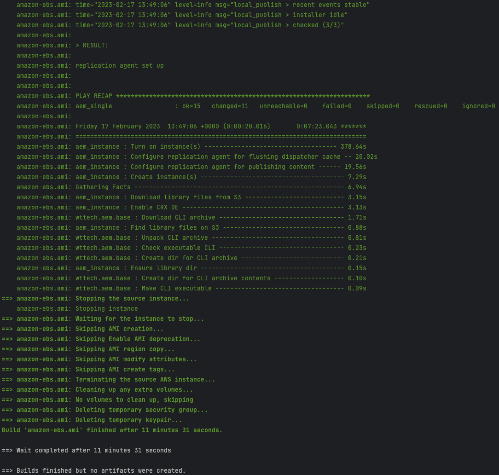
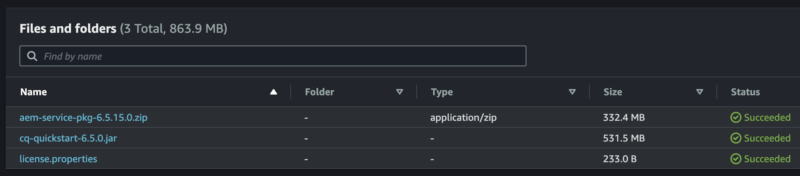

[](https://www.wundermanthompson.com/service/technology)

[](http://www.apache.org/licenses/)

# AEM Compose - Packer Example

Set up AEM instances on [AWS EC2](https://aws.amazon.com/ec2/) machine using [AEM Compose Ansible](https://github.com/wttech/aemc-ansible) Modules.

[Packer](https://www.packer.io/) tool used in this example allows to:

* launch & terminate automatically machine for tests using `skip_create_ami = true` [option](https://developer.hashicorp.com/packer/plugins/builders/amazon/ebs#skip_create_ami).
* allows to bake machine image when `skip_create_ami = false`

## Example result



## Prerequisites

1. Build [controller](../controller/README.md) using command

   ```shell
   (cd ../controller && sh build.sh)
   ```

2. Set up AWS environment variables

   ```shell
   export AWS_ACCESS_KEY_ID=xxx
   export AWS_SECRET_ACCESS_KEY=yyy
   ```

3. Adjust AWS [S3 bucket name and dir](group_vars/all/aem.yml#L7-L8) and upload AEM library files (aem-sdk.jar, cq-quickstart.jar, license.properties, etc)

   

# Building 

Running this command will launch AWS EC2 Machine, invoke [Ansible playbook](aem_single.yml), then terminate machine.

```shell
sh build.sh test classic
sh build.sh test cloud
```

To [debug](https://developer.hashicorp.com/packer/docs/commands/build#debug) build process e.g do not terminate machine too quickly, run:

```shell
sh build.sh debug classic
sh build.sh debug cloud
```

# Known issues

## Mitogen

This project is using [Ansible Mitogen](https://mitogen.networkgenomics.com/ansible_detailed.html#demo) which seriously improves Ansible execution time.
However, Mitogen comes with a little trade-off. It's not being updated regularly and sticks to a particular, not always up-to-date Ansible version. In other words, Mitogen disallows to use of the most recent Ansible version so using it should be considered with care. But still, in most cases using it could be very valuable.

### Disabling Mitogen

1. Comment out line with `strategy_plugins` in [ansible.cfg](ansible.cfg)
2. Comment out line `strategy: mitogen_linear` in playbook [aem_single.yml](aem_single.yml)
